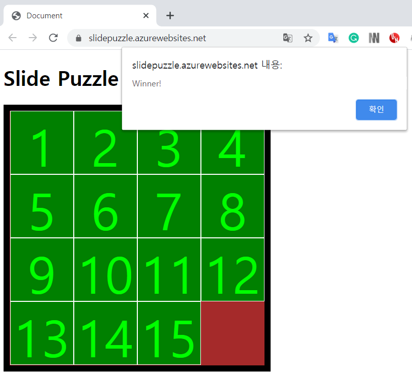

<h1> Slide Puzzle </h1>
Live Page: <a href="https://slidepuzzle.azurewebsites.net" target="_blank"> https://slidepuzzle.azurewebsites.net </a>
 

Source Page: <a href="https://github.com/kellyshaprk/SlidePuzzle_JavaScript-Azure" target="_blank"> https://github.com/kellyshaprk/SlidePuzzle_JavaScript-Azure </a> 
Click a square, then the square will move if there exists a blank space. 
 You can move more than one square! 
 Sequence the puzzle in order and the game alerts a message, "Winner!" 

